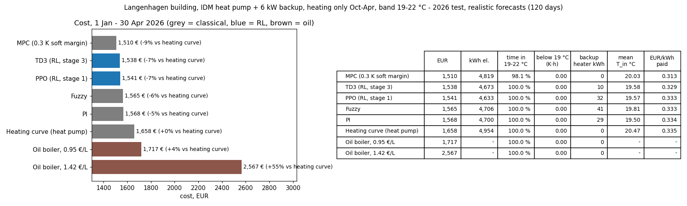

# Opti-Heat Building Gym

RL vs. classical control of a real heat pump: a multi-family building in **Langenhagen (Hannover)** with an **IDM AERO ALM 4-12** air-source heat pump and a 6 kW electric backup heater. 5-min control steps; trained on 2025, tested on Jan–Apr 2026.

## Building and rules

| | |
|---|---|
| Thermal capacitance `mC` / heat loss `K` | 74,600,000 J/K / 366 W/K (time constant ≈ 56.6 h, validated) |
| Heat pump | IDM AERO ALM 4-12 datasheet model: output falls with outdoor temperature (9.6 kW at −10 °C), COP 1.66 (−20 °C) … 5.43 (+20 °C) |
| Backup heater | 6 kW, COP 1, **automatic** safety function below 19 °C (not controllable) |
| Rules | heating only, **1 Oct – 30 Apr**, comfort band **19–22 °C** |
| Data | Langenhagen weather + Tibber 15-min prices; prices only as published (~13:00 for the next day), real day-ahead weather forecasts (±0.9 K) |

⚠️ Script defaults are still the old toy building. Training settings used (see `CHANGELOG.md` §27–30):
```
--reward_mode band --obs_variant C06 --mC 74600000 --K 366 --Q_HP_Max 12000 --scop --dt-scale 1.0 --backup-kw 6
--gamma 0.998 --economic-weight 5 --start-mode carry --episode-days 7
--forecast-error-path data/langenhagen_forecast_error_5min_2025.csv
```
Test: `python prepare_langenhagen_data.py --year 2026 --forecast` then `python run_inference.py --year 2026 --algorithm <sac|ppo|ddpg|td3|a2c|mpc|pi|fuzzy|curve>`.

## Results (2026 test, 1 Jan – 30 Apr, 120 days, continuous)



| Controller | Cost | vs heating curve |
|---|---|---|
| **MPC** (0.3 K soft margin) | **1,510 €** | −9 % |
| TD3 (RL) | 1,538 € | −7 % |
| PPO (RL) | 1,541 € | −7 % |
| Fuzzy / PI | 1,565 – 1,568 € | −6 / −5 % |
| Heating curve (standard heat pump control) | 1,658 € | — |
| Oil boiler, same heat | 1,717 – 2,567 € (0.95 – 1.42 €/L) | +4 … +55 % |

All controllers keep 19–22 °C ≥ 98 % of the time. Daily plots: [MPC](docs/figures/mpc_margin0.3_summary.png), [TD3](docs/figures/td3_rl_summary.png).

## Current state

- Three training stages (5 algorithms × 3 seeds each) done. The best RL agents reach PI level and beat the heating curve and oil, but **MPC is still the best controller**.
- RL agents learned the rules and to run the house cooler, but **not to shift heating into cheap hours** (they pay ~0.33 €/kWh, MPC 0.31). With realistic starts they ride close to 19 °C and trigger the backup heater more.
- Models in the repo: `models/band/C06_ew5carry/best_td3_seed43/` (TD3), `models/band/C06/ppo_model_seed43.zip` (PPO). Full history and all numbers: [CHANGELOG.md](CHANGELOG.md).
